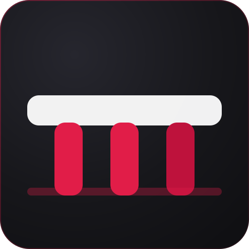

<div align="center">



# causeway

**Fast. Beautiful. For every language.**

A cross platform code editor built on Electron, Monaco and XTerm, with
diagnostics that tell you *why* something broke and *how* to fix it.

[Install](#install) · [Quick start](#quick-start) · [Shortcuts](docs/user-guide/keyboard-shortcuts.md) · [Contributing](docs/CONTRIBUTING.md)

</div>

---

## What is causeway

causeway is a standalone code editor. It opens a folder, gives you syntax
highlighting for more than sixty languages, a real terminal in the bottom
panel, and a Problems view that explains every error in plain language instead
of repeating the compiler at you.

It is MIT licensed, sends no telemetry unless you switch it on, and runs on
Windows, macOS and Linux.

## Features

- **Editor** built on Monaco: multi cursor, find and replace with regular
  expressions, code folding, minimap, breadcrumbs, go to definition, rename
  symbol, format document.
- **69 languages** recognised by extension, exact file name or `#!` line,
  including the extensionless ones such as `Dockerfile` and `Makefile`.
- **Diagnostics that explain themselves.** Every problem carries four things:
  what is wrong, where it is, why it happened, and what to do about it.
- **Integrated terminal** on XTerm with a real pseudo terminal, shell detection
  (PowerShell 7, Windows PowerShell, Git Bash, WSL, zsh, bash, fish) and
  multiple tabs.
- **12 colour themes**, dark, light and two high contrast, switched live from a
  picker with previews. Theme changes repaint in one frame.
- **Command palette and quick open** with fuzzy matching, plus a full keyboard
  shortcut reference built into the app.
- **Workspace search** across files with regex, case, whole word and glob
  filters.
- **File type icons** for every recognised language, in the explorer and on the
  tabs, so a folder is scannable at a glance.
- **Desktop shortcut on demand.** The installers create one; for a portable
  build or an AppImage, causeway offers once on first run, and the Command
  Palette and Settings can create or remove it at any time.
- **No telemetry by default.** Nothing leaves your machine until you opt in.

## Website

The download and marketing site lives in [website/](website/). It is a separate
Vite and React app with its own dependencies:

```bash
cd website
npm install
npm run dev     # http://localhost:5180
npm run build   # static output in website/dist
```

Everything the site claims about causeway comes from `website/src/data/content.ts`,
so the language count, the theme count and the download file names cannot drift
from the product.

## Install

### Download

Prebuilt installers are published on the
[releases page](https://github.com/irisclint/causeway/releases):

| Platform | File |
| --- | --- |
| Windows 10/11 | `causeway-<version>-x64-setup.exe` |
| macOS 12+ | `causeway-<version>-<arch>.dmg` |
| Linux | `causeway-<version>-x64.AppImage`, `.deb` or `.rpm` |

### Build from source

```bash
git clone https://github.com/irisclint/causeway.git
cd causeway
npm install
npm run assets:icons   # generates every raster icon from the SVG master
npm run dev            # starts the app with hot reload
```

To produce an installer for your platform:

```bash
npm run build:win     # or build:mac, build:linux
```

Requirements: Node.js 22.12 or newer. Native modules (`node-pty`) need the
usual build tooling: Visual Studio Build Tools on Windows, Xcode command line
tools on macOS, `build-essential` and `python3` on Linux. If `node-pty` cannot
be built, the terminal still works through plain pipes and says so.

## Quick start

1. **Open a folder** with `Ctrl+K Ctrl+O`, or the button in the Explorer.
2. **Jump to any file** with `Ctrl+P` and start typing part of its name.
3. **Run anything** with `Ctrl+Shift+P`, the command palette; every causeway
   command lives there with its shortcut next to it.
4. **Open the terminal** with ``Ctrl+` ``. It starts in your workspace folder.
5. **See your problems** with `Ctrl+Shift+M`. Expand a row to get the cause and
   the fix.
6. **Change the look** with `Ctrl+K Ctrl+T` and hover a theme to preview it
   live.

## How diagnostics work

Most editors show you what a compiler said. causeway adds two lines that the
compiler does not give you.

A plain TypeScript error looks like this:

```
Type 'string' is not assignable to type 'number'.
```

causeway shows the same message, and underneath:

> **Where** src/config.ts, line 1, column 7
> **Why** A value of type string was assigned where number is required. The two
> types have no common shape.
> **Fix** Convert the value to number, widen the target type, or fix the source
> so it produces number.

The explanations live in
[`src/renderer/editor/diagnostic-explainer.ts`](src/renderer/editor/diagnostic-explainer.ts).
They cover the TypeScript and ESLint codes developers hit most, fall back to
message heuristics for anything else, and always produce a cause and a fix.
Adding an explanation is a two line change and a welcome first contribution.

## Keyboard shortcuts

The full table lives in
[docs/user-guide/keyboard-shortcuts.md](docs/user-guide/keyboard-shortcuts.md),
and the same list is in the app under **Help → Keyboard Shortcuts**
(`Ctrl+K Ctrl+S`). The ones worth learning first:

| Shortcut | Action |
| --- | --- |
| `Ctrl+P` | Go to file |
| `Ctrl+Shift+P` | Command palette |
| `Ctrl+B` | Toggle the sidebar |
| ``Ctrl+` `` | Toggle the terminal |
| `Ctrl+Shift+M` | Problems |
| `Ctrl+K Ctrl+T` | Colour theme |
| `Ctrl+D` | Select the next occurrence |
| `F12` | Go to definition |

On macOS use `Cmd` wherever the table says `Ctrl`.

## Project layout

```
src/
  main/        Electron main process: windows, menu, IPC, filesystem, terminal
  preload/     The only bridge the renderer can reach
  renderer/    React UI, Monaco integration, theme engine, stores
  shared/      Types, errors and helpers used by every process
resources/     Logo, icons, locales
docs/          Architecture, user guide and API documentation
tests/         Unit, integration and end to end tests
website/       The download site, a separate Vite and React app
```

[docs/architecture/overview.md](docs/architecture/overview.md) explains how the
three processes fit together and why the boundaries sit where they do.

## Performance targets

causeway is built against explicit budgets, measured on a mid range laptop:

| Metric | Target | 1.1.2 |
| --- | --- | --- |
| Cold start to a visible window | under 2 s | 1.6 s |
| Warm start | under 500 ms | met |
| Idle memory, working set | under 400 MB | 328 MB |
| Opening a 50,000 line file | no perceptible lag | met |
| Theme switch | under 100 ms | met |
| Installer size | under 200 MB | 114 MB |

Idle memory is the working set of all four processes with no folder open,
measured eighty seconds after launch, once it has settled; private memory is
206 MB. The figure published for 1.0.0 was 420 MB and was recorded as a miss.
Nothing was done to memory between the two releases, so the difference is the
measurement rather than the software: that reading was taken on a machine with
more running and a data directory carrying state from development. The number
here is what this build does on a quiet machine, and it is the one worth
trusting only as far as that.

Large files drop the minimap, folding and bracket colouring above 4 MB, which
is what keeps them responsive.

## Status

Version 1.1.2. The editor, terminal, themes, search, command palette,
diagnostics, source control, the debugger and the sandboxed extension host all
work, and every one of them is covered by tests that run on each build.

Two things are not done, and the editor says so where you would look for them
rather than leaving you to find out: no extension registry has been published,
so the marketplace client has nothing to browse, and the builds are not code
signed. Binaries are published for Windows; macOS and Linux have to be built
on macOS and Linux, and can be built from source today.

## FAQ

**Is this a VS Code fork?**
No. causeway is written from scratch on the same public building blocks VS Code
uses (Electron and Monaco, both open source). It has its own UI, its own theme
format, its own logo and its own diagnostic layer.

**Does it send my code anywhere?**
No. There is no telemetry unless you turn it on in Settings, and no network
request except the update check, which you can also disable.

**Can I use my VS Code themes?**
Not directly. causeway uses a similar JSON format, so porting one is mostly a
copy of the `colors` and `tokenColors` blocks. See
[docs/api/theme-api.md](docs/api/theme-api.md).

**Where are my settings stored?**
In `settings.json` inside the Electron user data folder:
`%APPDATA%/causeway` on Windows, `~/Library/Application Support/causeway` on macOS,
`~/.config/causeway` on Linux.

## Contributing

Bug reports, language definitions, themes and diagnostic explanations are all
welcome. Start with [docs/CONTRIBUTING.md](docs/CONTRIBUTING.md).

## License

MIT. See [LICENSE](LICENSE).
